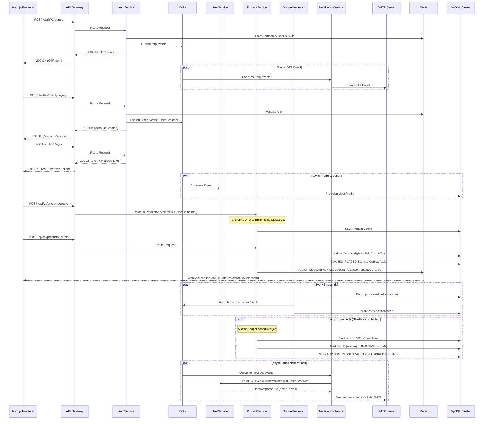

# AuctionU - University Marketplace Platform

Welcome to **AuctionU**, a robust, event-driven microservices architecture designed alongside a modern, dynamic Next.js frontend to securely facilitate university marketplace trades. It provides a secure space for students to list items, participate in live bidding, and manage transactions within the campus community. The system leverages modern Java/Spring Boot microservices, Next.js App Router UI, reactive caching, real-time WebSocket broadcasting, distributed lock scheduling, asynchronous messaging, and transactional email notifications.

## 🚀 System Architecture

The platform spans a full-stack environment consisting of a **Next.js frontend (`auction-ui`)** seamlessly wired to a scalable Spring Boot backend consisting of multiple microservices: `gateway`, `authService`, `userService`, `productService`, and `notificationService`. Services are decoupled via **Apache Kafka** using the **Transactional Outbox Pattern**, and backed by **Redis** and **MySQL**. All internal services are discovered automatically via **Eureka**.



## 🌟 Key Features

### 1. Full-Stack End-to-End Environment

Everything from the sophisticated **TailwindCSS Next.js UI** down to the **Redis WebSocket STOMP relays** is containerized. It works flawlessly under **Docker Compose**, wrapping 11 integrated clusters natively.

### 2. High Scalability & Event-Driven Operations

The system is engineered to handle high-traffic bidding environments effortlessly:

- **Stateless Authentication**: Uses **JWT (JSON Web Tokens)** allowing horizontal scaling of the `authService`.JWT claims embed the `userId` natively, securely translating to the `X-User-Id` header through the API Gateway footprint.
- **Transactional Outbox Pattern**: Instead of publishing directly to Kafka (risking failure), domain events (`BID_PLACED`, `PURCHASE`, `AUCTION_CLOSED`) are saved atomically to the DB's `outbox` table. A separate polling `OutboxProcessor` guarantees at-least-once message delivery via Kafka.
- **Distributed Lock Scheduling (ShedLock)**: The automated `AuctionReaper` job uses ShedLock (`shedlock-provider-jdbc-template`) synchronized on MySQL. This completely eliminates race conditions and duplicate auction settlements when scaling instances horizontally.

### 3. Real-Time Bid Broadcasting (WebSocket + Redis Pub/Sub)

Instant visual updates to users using STOMP WebSocket communication dynamically bridging to the UI dashboard:

1. `ProductService` publishes `"{productId}:New bid: {amount}"` to the **Redis `auction-updates` channel**.
2. **`RedisSubscriber`** detects and resolves it over STOMP topic `/topic/product/{productId}` via `SimpMessagingTemplate`.
3. The **Next.js UI (`use-auction-socket.ts`)** immediately updates the React state reflecting live numbers continuously without requiring HTTP refresh loops.

### 4. Data Privacy & Listing Control

Users retain full control over their presence and interactions on the platform:

- **Listing Management**: Sellers can instantly remove their own active listings (both fixed-price and auctions) securely via the UI, backed by robust `X-User-Id` gateway verification and a `DELETED` soft-delete state for audit trails.
- **Account Deletion**: Complete self-service account deletion securely wipes all local session data, cascades the destruction of JWT refresh tokens from the `authService`, and permanently removes profile telemetry across the `userService`.

### 5. Microservices Overview

- **A. UI Frontend (`auction-ui`)**: Next.js App Router featuring responsive Shadcn-UI design, Framer Motion animations, comprehensive Auth caching logic, and `stompjs/sockjs-client` socket channels for live auction interactions.
- **B. API Gateway (`gateway`)**: Centralized security, rate limiting, token parsing, and service routing. Netty WebFlux server capable of translating CORS correctly and parsing tokens.
- **C. Auth Service (`authService`)**: Secure enrollment with complex password constraints, OTP-based email verification, and JWT issuer.
- **D. User Service (`userService`)**: Independent persistence of user profiles communicating through shared secrets restricting any external endpoint hijacking.
- **E. Product Service (`productService`)**: Core logistics engine governing the business rules behind `AUCTION` and `FIXED_PRICE` sales types.
- **F. Notification Service (`notificationService`)**: Spring Boot Mail / Thymeleaf engine listening on consumers (`otp-events`, `product-events`) and sending emails via SMTP using Eureka + OpenFeign. This service is intentionally stateless in the current implementation (no JPA entities/repositories), so the `notificationservice` MySQL schema exists but has no application tables.

## 🔧 Technical Stack

- **Frontend**: Next.js 14 (App Router), TypeScript, Tailwind CSS, Framer Motion, Zustand/Context, Stompjs
- **Backend Core**: Java 17, Spring Boot 3.x, Gradle 8.x
- **Infrastructure**: Spring Cloud Gateway, Netflix Eureka Server
- **Messaging Layer**: Apache Kafka, Zookeeper, Redis Pub/Sub
- **Databases**: MySQL (JPA/Hibernate), JDBC Template
- **DevOps**: Docker, Docker Compose, Flyway/Init SQLs
- **Protocols**: WebSocket (STOMP)/SockJS, REST, JWT Authentication

## 🌐 Live Demo

**Frontend (Vercel)**: [https://auction-o42wxhnf3-arnavs-projects-ffeca390.vercel.app](auction-u.vercel.app)

> **Note**: The backend runs locally via Docker and is exposed through ngrok. The live demo requires the backend to be running on the developer's machine.

## 🏗️ Deployment Architecture

The project uses a **hybrid deployment** model:

```
┌──────────────────┐         ┌─────────────────────────────────┐
│   Vercel Cloud   │         │     Local Machine (Docker)      │
│                  │  HTTPS  │                                 │
│  auction-ui      │ ◄─────► │  ngrok ──► Gateway (:8080)      │
│  (Next.js)       │         │              │                  │
│                  │         │     ┌────────┼────────┐         │
└──────────────────┘         │     ▼        ▼        ▼         │
                             │  Auth    Product   User         │
                             │  Service  Service  Service      │
                             │     │        │        │         │
                             │  MySQL  Kafka  Redis  Eureka    │
                             └─────────────────────────────────┘
```

- **Frontend**: Deployed on **Vercel**, auto-deploys on push to `main`
- **Backend**: All Spring Boot microservices + infrastructure run locally via **Docker Compose**
- **Tunnel**: **ngrok** exposes the local API Gateway (`localhost:8080`) to the internet, allowing the Vercel-hosted frontend to communicate with the backend

## 🏃‍♂️ Running the Project

### Prerequisites

- Docker & Docker Compose
- [ngrok](https://ngrok.com) (free account, authenticated)

### 1. Configure Environment

Create a local `.env` file (never commit it) from `.env.example`:

```bash
MAIL_USERNAME=your-email@example.com
MAIL_PASSWORD=your-app-password
```

### 2. Start the Backend

```bash
docker-compose up --build -d
```

This boots up MySQL, Zookeeper, Kafka, Redis, Eureka, and all Spring Boot microservices (auth, user, product, notification, gateway).

### 3. Expose the Backend via ngrok

```bash
ngrok http 8080
```

Copy the generated HTTPS URL (e.g., `https://xxxx.ngrok-free.dev`).

### 4. Update Vercel Environment Variables

In the [Vercel Dashboard](https://vercel.com) → Project Settings → Environment Variables, set:

| Variable | Value |
|---|---|
| `NEXT_PUBLIC_GATEWAY_URL` | `https://xxxx.ngrok-free.dev` |
| `NEXT_PUBLIC_GATEWAY_WS_URL` | `wss://xxxx.ngrok-free.dev/ws-auction` |

Then trigger a redeployment for the changes to take effect.

### 5. Update Gateway CORS (if ngrok URL changed)

Add the new ngrok URL to `gateway/app/src/main/resources/application.yml` under `allowedOrigins`, rebuild the gateway, and restart:

```bash
cd gateway && ./gradlew clean build -x test && cd ..
docker-compose up --build -d gateway
```

### What happens?

1. The `mysql:8.0` cluster boots up and initializes service schemas via `init.sql`; only services that persist domain state create tables (for example, product service tables such as `shedlock`), while `notificationService` currently keeps no DB tables by design.
2. Infrastructure shards `zookeeper`, `kafka`, `eureka-server`, and `redis-alpine` boot alongside one another.
3. Every individual Spring Boot service successfully compiles inside multi-stage `eclipse-temurin` pipelines and starts, connecting and automatically registering their domains natively to the `eureka` discovery pipeline.
4. ngrok tunnels external HTTPS traffic to the local Gateway on port `8080`.
5. The Vercel-hosted frontend communicates with the backend through the ngrok tunnel.

### Access Points

- **Live Frontend**: [https://auction-o42wxhnf3-arnavs-projects-ffeca390.vercel.app](https://auction-o42wxhnf3-arnavs-projects-ffeca390.vercel.app)
- **Local Frontend** (optional): `http://localhost:3000` (run `npm run dev` inside `auction-ui/`)
- **API Gateway**: `http://localhost:8080/` (or via ngrok URL)
- **Discovery Console**: `http://localhost:8761/` (Eureka dashboard)
- **ngrok Inspector**: `http://localhost:4040` (monitor tunneled requests)

### Stopping

```bash
docker-compose down
```

