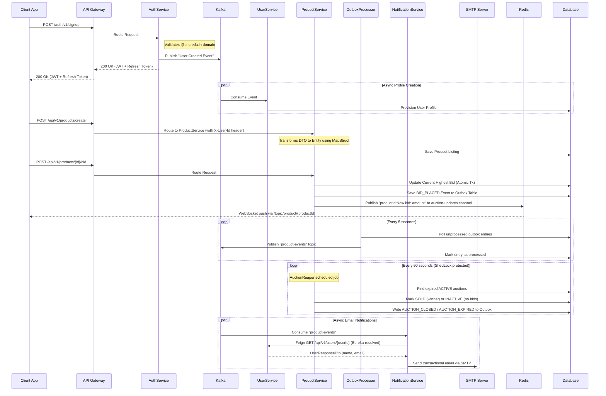

# AuctionU - University Marketplace Platform

Welcome to **AuctionU**, a robust, event-driven microservices architecture designed for a highly scalable university marketplace platform. It provides a secure space for students to list items for direct sale, bid on auctions, and trade within the university community. The system leverages modern Java/Spring Boot practices, reactive caching, real-time WebSocket broadcasting, distributed lock scheduling, asynchronous messaging, and transactional email notifications.

## 🚀 System Architecture

The system is split into multiple microservices: `gateway`, `authService`, `userService`, `productService`, and `notificationService`, decoupled asynchronously via **Apache Kafka** using the **Transactional Outbox Pattern**, and backed by **Redis** and **MySQL/PostgreSQL**. Services are discovered and load-balanced via **Eureka**.



## 🌟 Key Features

### 1. High Scalability & Event-Driven Operations

The system is designed to handle high-traffic bidding environments effortlessly:

- **Stateless Authentication**: Uses **JWT (JSON Web Tokens)** allowing horizontal scaling of the `authService`. Access is strictly limited to university students (e.g., matching `@snu.edu.in` constraints). JWTs embed both the `userId` (UUID) and `roles` claims, which are forwarded as the `X-User-Id` header by the Gateway to downstream services.
- **Transactional Outbox Pattern**: Instead of publishing directly to Kafka (which risks message loss on failure), all domain events (`BID_PLACED`, `PURCHASE`, `AUCTION_CLOSED`, `AUCTION_EXPIRED`) are first written atomically to a dedicated **`outbox` database table** within the same transaction as the business operation. A separate `OutboxProcessor` then polls this table every 5 seconds and reliably forwards events to Kafka.
- **Guaranteed Message Delivery**: By coupling the outbox write with the business transaction, the system ensures no event is ever lost — even if Kafka is temporarily unavailable.
- **Distributed Lock Scheduling (ShedLock)**: The `AuctionReaper` scheduled job is protected by **ShedLock** (`shedlock-provider-jdbc-template`), ensuring that in a multi-instance/horizontally-scaled deployment, only one instance runs the reaper job at a time, preventing duplicate auction settlements.

### 2. Real-Time Bid Broadcasting (WebSocket + Redis Pub/Sub)

When a bid is placed, the update is instantly pushed to all connected clients watching that auction:

1. `ProductServiceImpl#placeBid` publishes a `"{productId}:New bid: {amount}"` message to the **Redis `auction-updates` channel** via `StringRedisTemplate`.
2. The **`RedisSubscriber`** service listens on this channel. Because Redis Pub/Sub is cluster-aware, this works correctly across multiple service instances.
3. `RedisSubscriber` forwards the message to the **STOMP WebSocket topic** `/topic/product/{productId}` via `SimpMessagingTemplate`.
4. Clients connected to the **`/ws-auction`** STOMP endpoint (routed through the Gateway) receive the live update instantly.

### 3. Microservices Overview

#### A. API Gateway (`gateway`)
**Responsibility**: Centralized entry point, routing, JWT validation, and rate limiting.
- **Role**: All client requests go through the Spring Cloud Gateway (reactive, Netty-based). It routes to the appropriate microservice (`authService`, `productService`, `userService`), extracts the `userId` from the JWT, and injects it as an `X-User-Id` header for downstream services.
- **WebSocket Routing**: A dedicated route (`/ws-auction/**`) proxies WebSocket/SockJS connections directly to the `productService`, enabling real-time auction updates.
- **Rate Limiting**: The `/api/v1/users/**` route is protected by a Redis-backed `RequestRateLimiter` filter (5 req/s replenish rate, 10 burst capacity), keyed by user ID.
- **Open Endpoints**: `/auth/v1/signup`, `/auth/v1/login`, and `/auth/v1/refreshToken` are whitelisted in the `RouteValidator` and bypass JWT authentication.

#### B. Auth Service (`authService`)
**Responsibility**: Secure authentication, token generation, and credential storage.
- **Endpoints**: Handles student signup (`POST /auth/v1/signup`), login (`POST /auth/v1/login`), token refresh (`POST /auth/v1/refreshToken`), logout (`POST /auth/v1/logout`), and a JWT validation ping (`GET /auth/v1/ping`).
- **Domain Validation**: Enforces `@snu.edu.in` email domain via `ValidateUserUtil`. Password strength is also enforced (uppercase, lowercase, digit, special character required).
- **JWT Structure**: Tokens embed `userId` (UUID) and `roles` claims. The `JwtService` acts as a **shared secret verifier** — the same key is used in both `authService` (issuance) and `gateway` (validation).
- **Producer**: On successful signup, publishes a `UserInfoDto` event to Kafka to trigger async profile creation in `userService`. Uses `UserInfoProducer` with the topic configured via `spring.kafka.topic.name`.
- **Refresh Tokens**: `RefreshTokenService` manages persistent refresh tokens stored in MySQL, enabling secure session renewal without re-authentication.

#### C. User Service (`userService`)
**Responsibility**: Managing user profiles and contact information.
- **Consumer**: `AuthServiceConsumer` listens to the shared Kafka topic and calls `UserService#createOrUpdateUser` to provision or sync user profiles from auth events.
- **REST API (Internal)**: Exposes internal-only endpoints (`/user/createUpdate`, `/user/getUser`, `/user/{userId}`) protected by a shared `X-Internal-Secret` header, preventing direct external access.
- **Upsert Logic**: On receiving a Kafka event, the service checks if a user already exists by email. If yes, it updates profile fields; if not, it creates a new record using the UUID from the auth event.

#### D. Product/Auction Service (`productService`)
**Responsibility**: Core listings logistics, managing direct sales and auctions, real-time bid broadcasting, event publishing, and automated auction lifecycle management.
- **Dual Sale Types**: Supports both `FIXED_PRICE` (marketplace) and `AUCTION` listings, distinguished by the `SaleType` enum. Products expose different fields depending on type (`quantity`, `buyItNowPrice` for fixed; `startingPrice`, `auctionEndTime`, `currentHighestBid` for auctions).
- **Soft Deletion**: Enforces soft deletion by transitioning entity statuses to `DELETED` instead of destroying active database rows, retaining product/auction history.
- **Entity Pre-Processing**: Uses JPA `@PrePersist` to bootstrap `createdAt` and initialize `currentHighestBid` from `startingPrice` at creation time.
- **Transactional Outbox (Bids & Purchases)**: On every `placeBid` or `purchaseProduct`, a `ProductEvent` is serialized and saved to the `outbox` table atomically, guaranteeing the event reaches Kafka exactly once via the `OutboxProcessor`.
- **Real-Time Bid Updates**: On every successful `placeBid`, a message is published to the Redis `auction-updates` Pub/Sub channel, which is then forwarded to all WebSocket subscribers watching that product.
- **AuctionReaper (Distributed Scheduled Job)**: Runs every **60 seconds** under a **ShedLock** exclusive lock (`auctionReaperLock`, at least 30s, at most 50s). Finds all `ACTIVE` auctions past their `auctionEndTime`, transitions them to `SOLD` (if a highest bidder exists) or `INACTIVE` (if no bids), and writes a corresponding `AUCTION_CLOSED` or `AUCTION_EXPIRED` event to the outbox.
- **Kafka Topic**: All product domain events are published to the `product-events` Kafka topic, configured via `KafkaConfig`.
- **MapStruct**: Uses MapStruct for clean, compile-time-safe DTO ↔ Entity mapping.

#### E. Notification Service (`notificationService`)
**Responsibility**: Consuming product domain events from Kafka and sending transactional email notifications to users.
- **Kafka Consumer**: `NotificationConsumer` listens to the `product-events` topic (consumer group: `notification-group`). On receiving a `ProductEvent`, it resolves the associated user's contact information and dispatches a contextual email.
- **Feign Client (Eureka-Discovered)**: Uses **Spring Cloud OpenFeign** with a `@FeignClient(name = "USER-SERVICE")` to call the `userService` (`GET /api/v1/users/{id}`). Service discovery is handled by **Eureka**, so no hardcoded URLs are required — the client automatically resolves the `USER-SERVICE` instance.
- **Email Dispatch**: Uses **Spring Boot Mail** (`JavaMailSender`) configured with Gmail SMTP (`smtp.gmail.com:587`, STARTTLS) along with **Thymeleaf** (`TemplateEngine`) for rich HTML emails. It constructs `MimeMessage` notifications with dynamic template variables (e.g., user name, product title, bid amount).
- **Event Handling**: Retrieves context from domain events and injects them seamlessly into the `bid-notification` HTML template.
- **Fault Tolerance & Retries**: Leverages Spring Kafka's `@RetryableTopic` to automatically retry message consumption on failures (e.g., mail server timeouts) using exponential backoff. Permanently failing messages (e.g. after max attempts) are routed to a Dead-Letter Topic (DLT) managed by an `@DltHandler`.

## 📦 Components Reference

### productService

| Component | Type | Description |
|---|---|---|
| `KafkaConfig` | `@Configuration` | Declares the `product-events` Kafka topic (3 partitions). |
| `RedisConfig` | `@Configuration` | Configures the `auction-updates` Redis Pub/Sub channel and wires `RedisSubscriber` as the message listener. |
| `ShedLockConfig` | `@Configuration` | Configures ShedLock with a JDBC-backed `LockProvider` using DB time. Annotated with `@EnableSchedulerLock`. |
| `WebSocketConfig` | `@Configuration` | Enables STOMP over WebSocket. Registers the `/ws-auction` endpoint (with SockJS fallback) and sets `/topic` as the broker prefix and `/app` as the application prefix. |
| `ProductEvent` | DTO | Payload for all product domain events (`BID_PLACED`, `PURCHASE`, `AUCTION_CLOSED`, `AUCTION_EXPIRED`). Fields: `eventType`, `productId`, `title`, `amount`, `userId`, `sellerId`, `timeStamp`. |
| `OutboxEntity` | `@Entity` | JPA entity mapped to the `outbox` table. Stores serialized `ProductEvent` JSON, `aggregateId` (product ID), `eventType`, `createdAt`, and `processed` flag. |
| `OutboxRepository` | `@Repository` | Spring Data repository for `OutboxEntity`. Exposes `findByProcessedFalse()` for the polling processor. |
| `OutboxProcessor` | `@Service` | Scheduled every **5 seconds**. Polls unprocessed outbox rows, publishes them to the `product-events` Kafka topic, and marks them as processed. |
| `AuctionReaper` | `@Service` | Scheduled every **60 seconds** under ShedLock. Detects expired auctions, settles their status, and writes close/expire events to the outbox. |
| `RedisSubscriber` | `@Service` | Listens to the Redis `auction-updates` Pub/Sub channel. Parses messages and forwards bid updates to the correct STOMP WebSocket topic (`/topic/product/{productId}`). |
| `ProductServiceImpl` | `@Service` | Core business logic. On `placeBid`, atomically updates the bid in the DB, writes to the outbox, and publishes to Redis. On `purchaseProduct`, decrements quantity, sets `SOLD` when stock hits 0, and writes to outbox. |

### notificationService

| Component | Type | Description |
|---|---|---|
| `NotificationServiceApplication` | `@SpringBootApplication` | Entry point. Annotated with `@EnableFeignClients` to activate Feign client scanning. |
| `NotificationConsumer` | `@Service` | Kafka listener on the `product-events` topic. Resolves user info via `UserClient`, models HTML email content using Thymeleaf, and dispatches via `JavaMailSender`. Uses `@RetryableTopic` for automated retries with backoff, and tracks ultimate failures inside an `@DltHandler`. |
| `UserClient` | `@FeignClient` | Declarative REST client targeting `USER-SERVICE` (Eureka-discovered). Calls `GET /api/v1/users/{id}` to fetch user profile (name, email). |
| `ProductEvent` | DTO | Mirrors the product service's event payload. Fields: `eventType`, `productId`, `title`, `amount`, `userId`, `sellerId`, `timeStamp`. |
| `UserResponseDto` | DTO | Response model from `userService`. Fields: `id`, `name`, `email`. |

### gateway

| Component | Type | Description |
|---|---|---|
| `AuthenticationFilter` | `GatewayFilter` | Validates JWT tokens on all secured routes. Extracts `userId` and injects it as the `X-User-Id` header into downstream requests. |
| `RouteValidator` | `@Component` | Defines public (open) endpoints that skip JWT validation: `/auth/v1/signup`, `/auth/v1/login`, `/auth/v1/refreshToken`. |
| `JwtUtils` | `@Component` | Stateless JWT validation and claim extraction (shared secret with `authService`). |
| `RedisConfig` | `@Configuration` | Provides a `KeyResolver` bean for Redis-backed rate limiting, keyed by `X-User-Id`. |

## 🔧 Technical Stack

- **Backend**: Java 17 (Spring Boot 3.x / 4.x)
- **Build Tool**: Gradle (Groovy DSL for services, Kotlin DSL for gateway)
- **API Gateway**: Spring Cloud Gateway (reactive, Netty)
- **Service Discovery**: Spring Cloud Netflix Eureka
- **Inter-Service Communication**: Spring Cloud OpenFeign (declarative REST clients)
- **Messaging**: Apache Kafka (`spring-kafka`, `@RetryableTopic` backoff features)
- **Reliability Pattern**: Transactional Outbox Pattern
- **Real-Time**: WebSocket (STOMP) + Redis Pub/Sub (`spring-boot-starter-websocket`, `spring-boot-starter-data-redis`)
- **Email Notifications**: Spring Boot Mail & Thymeleaf templates (`spring-boot-starter-mail`, `spring-boot-starter-thymeleaf`, Gmail SMTP)
- **Distributed Scheduling**: ShedLock (`shedlock-spring`, `shedlock-provider-jdbc-template`)
- **Caching & Rate Limiting**: Redis (`spring-boot-starter-data-redis-reactive` in gateway)
- **Database**: MySQL (JPA/Hibernate)
- **Security**: Spring Security, JWT (`jjwt 0.11.5`), shared secret validation
- **Serialization**: Jackson (`jackson-databind`)
- **Object Mapping**: MapStruct 1.5.5
- **Scheduling**: Spring `@EnableScheduling` / `@Scheduled`
- **Deployment**: Docker, Docker Compose

## 🌐 API Endpoints

### Auth Service (via Gateway)
| Method | Path | Auth | Description |
|---|---|---|---|
| `POST` | `/auth/v1/signup` | Public | Register a new university student |
| `POST` | `/auth/v1/login` | Public | Login and receive JWT + refresh token |
| `POST` | `/auth/v1/refreshToken` | Public | Exchange a refresh token for a new access token |
| `POST` | `/auth/v1/logout` | JWT | Invalidate the current refresh token |
| `GET` | `/auth/v1/ping` | JWT | Validate JWT and return user identity |

### Product Service (via Gateway)
| Method | Path | Auth | Description |
|---|---|---|---|
| `POST` | `/api/v1/products/create` | JWT | List a new product (auction or fixed-price) |
| `GET` | `/api/v1/products/marketplace` | JWT | Get all active fixed-price listings |
| `GET` | `/api/v1/products/auction` | JWT | Get all active auction listings |
| `POST` | `/api/v1/products/{id}/bid` | JWT | Place a bid on an auction item |
| `POST` | `/api/v1/products/{id}/purchase` | JWT | Purchase a fixed-price item |

### WebSocket
| Endpoint | Protocol | Description |
|---|---|---|
| `/ws-auction` | STOMP/SockJS | Connect for real-time auction updates |
| `/topic/product/{productId}` | STOMP subscription | Receive live bid updates for a specific product |

## 🏃‍♂️ Local Development Setup

Ensure you have Docker and Docker Compose installed on your system.

1. **Start Backend Infrastructure**:
   Spin up all dependent services (MySQL, Kafka, Zookeeper, Redis) along with the microservices.
   ```bash
   docker-compose up -d --build
   ```

2. **Accessing the Services**:
   The API Gateway runs on port `8080` as the primary entry point. All clients interact with the Gateway, which routes internally to `authService` (port configurable), `productService`, `userService`, and `notificationService` (port `9005`). The `notificationService` requires the `MAIL_USERNAME` and `MAIL_PASSWORD` environment variables to be set for SMTP authentication.

3. **WebSocket Connection**:
   Connect via SockJS/STOMP to `ws://localhost:8080/ws-auction` and subscribe to `/topic/product/{productId}` to receive real-time bid updates.

4. **Stopping the Environment**:
   ```bash
   docker-compose down
   ```
