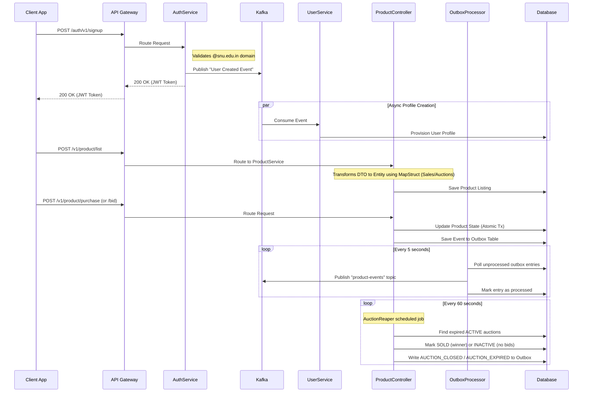

# AuctionU - University Marketplace Platform

Welcome to **AuctionU**, a robust, event-driven microservices architecture designed for a highly scalable university marketplace platform. It provides a secure space for students to list items for direct sale, bid on auctions, and trade within the university community. The system leverages modern Java/Spring Boot practices, reactive caching, and asynchronous messaging.

## 🚀 System Architecture

The system is split into multiple microservices: `gateway`, `authService`, `userService`, and `productService`, decoupled asynchronously via **Apache Kafka** using the **Transactional Outbox Pattern**, and backed by **Redis** and **MySQL/PostgreSQL**.



## 🌟 Key Features

### 1. High Scalability & Event-Driven Operations

The system is designed to handle high-traffic bidding environments effortlessly:

- **Stateless Authentication**: Uses **JWT (JSON Web Tokens)** allowing horizontal scaling of the `authService`. Access is strictly limited to university students (e.g., matching `@snu.edu.in` constraints).
- **Transactional Outbox Pattern**: Instead of publishing directly to Kafka (which risks message loss on failure), all domain events (`BID_PLACED`, `PURCHASE`, `AUCTION_CLOSED`, `AUCTION_EXPIRED`) are first written atomically to a dedicated **`outbox` database table** within the same transaction as the business operation. A separate `OutboxProcessor` then polls this table every 5 seconds and reliably forwards events to Kafka.
- **Guaranteed Message Delivery**: By coupling the outbox write with the business transaction, the system ensures no event is ever lost — even if Kafka is temporarily unavailable.

### 2. Microservices Overview

#### A. API Gateway (`gateway`)
**Responsibility**: Centralized entry point, routing, and load balancing.
- **Role**: All client requests (`App`) go through the Spring Cloud Gateway. It routes them to the appropriate microservice (`authService`, `productService`, etc.), abstracting the internal microservice topology from the client.

#### B. Auth Service (`authService`)
**Responsibility**: Secure authentication, Token Generation, Credential Storage.
- **Endpoints**: Handles student signup, login, and token issuance. Enforces university-domain emails using specialized validation structures (e.g. `UserRegistrationRequest`).
- **Producer**: Publishes events to Kafka upon user signup to inform downstream services. Built with transactional consistency, ensuring successful registration rollbacks if Kafka event parsing fails.
- **Data Integrity**: Uses synchronized UUID database generation and avoids transmitting sensitive credentials like passwords over message buses.

#### C. User Service (`userService`)
**Responsibility**: Managing User Profiles and contact information.
- **Consumer**: Silently watches the global Kafka broker to provision and sync profiles.
- **Integration**: Designed to sync profile mappings tightly with other internal services.

#### D. Product/Auction Service (`productService` / `ProductController`)
**Responsibility**: Core listings logistics, managing direct sales and auctions, event publishing, and automated auction lifecycle management.
- **Robust Validation**: Enforces strict backend validation annotations for robust DTO bindings (e.g. tracking constraints for pricing, auction end times, and seller relationships).
- **History Retention**: Enforces soft deletion by transitioning entity statuses to `DELETED` instead of destroying active database rows, thus retaining product/auction history.
- **Entity Pre-Processing**: Integrates into JPA `@PrePersist` lifecycles to bootstrap entity properties securely upon creation.
- **Transactional Outbox (Bids & Purchases)**: On every `placeBid` or `purchaseProduct` operation, a `ProductEvent` is serialized and saved to the `outbox` table atomically, guaranteeing the event reaches Kafka exactly once via the `OutboxProcessor`.
- **AuctionReaper (Scheduled Job)**: A `@Scheduled` service (`AuctionReaper`) runs every **60 seconds** to find all `ACTIVE` auctions past their `auctionEndTime`. It transitions them to `SOLD` (if a highest bidder exists) or `INACTIVE` (if no bids were placed), and writes a corresponding `AUCTION_CLOSED` or `AUCTION_EXPIRED` event to the outbox for downstream notification.
- **Kafka Topic**: All product domain events are published to the `product-events` Kafka topic (3 partitions, 1 replica), configured via `KafkaConfig`.
- **Database**: Stores completed sales, auctions, product details, and outbox entries robustly in a relational database.

## 📦 New Components (productService)

| Component | Type | Description |
|---|---|---|
| `KafkaConfig` | `@Configuration` | Declares the `product-events` Kafka topic (3 partitions). |
| `ProductEvent` | DTO | Payload for all product domain events (`BID_PLACED`, `PURCHASE`, `AUCTION_CLOSED`, `AUCTION_EXPIRED`). Fields: `eventType`, `productId`, `title`, `amount`, `userId`, `sellerId`, `timeStamp`. |
| `OutboxEntity` | `@Entity` | JPA entity mapped to the `outbox` table. Stores serialized `ProductEvent` JSON, `aggregateId` (product ID), `eventType`, `createdAt`, and `processed` flag. |
| `OutboxRepository` | `@Repository` | Spring Data repository for `OutboxEntity`. Exposes `findByProcessedFalse()` for the polling processor. |
| `OutboxProcessor` | `@Service` | Scheduled every **5 seconds**. Polls unprocessed outbox rows, publishes them to the `product-events` Kafka topic, and marks them as processed. |
| `AuctionReaper` | `@Service` | Scheduled every **60 seconds**. Detects expired auctions, settles their status, and writes close/expire events to the outbox. |

## 🔧 Technical Stack

- **Backend Languages**: Java (Spring Boot) / Kotlin
- **Build Tool**: Gradle
- **Messaging Pipeline**: Apache Kafka (`spring-kafka`)
- **Reliability Pattern**: Transactional Outbox Pattern
- **Caching & Synchronization**: Redis
- **Database Engine**: Relational (MySQL / PostgreSQL)
- **Security & Routing**: Spring Security, JWT, Spring Cloud Gateway
- **Serialization**: Jackson (`jackson-databind`), MapStruct
- **Scheduling**: Spring `@EnableScheduling` / `@Scheduled`
- **Deployment**: Docker, Docker Compose

## 🏃‍♂️ Local Development Setup

Ensure you have Docker and Docker Compose installed on your system.

1. **Start Backend Infrastructure**:
   Spin up all dependent services (Database, Kafka, Zookeeper) along with the microservices.
   ```bash
   docker-compose up -d --build
   ```
2. **Accessing the Services**:
   The API Gateway runs as the primary entry point. Clients interact directly with the Gateway, which then automatically maps and routes to internal domains (`authService`, `productService`, etc.).

3. **Stopping the Environment**:
   ```bash
   docker-compose down
   ```
