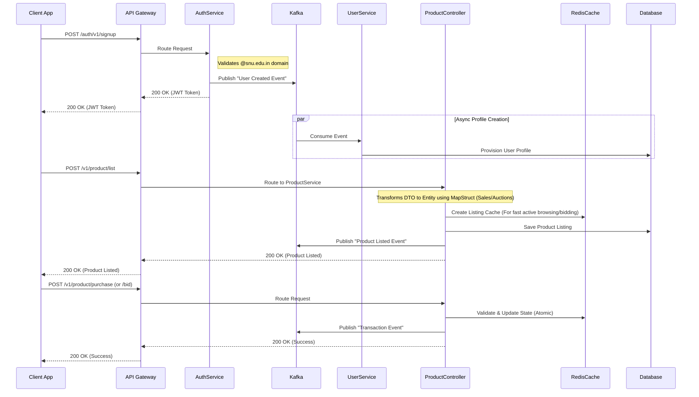

# AuctionU - University Marketplace Platform

Welcome to **AuctionU**, a robust, event-driven microservices architecture designed for a highly scalable university marketplace platform. It provides a secure space for students to list items for direct sale, bid on auctions, and trade within the university community. The system leverages modern Java/Spring Boot practices, reactive caching, and asynchronous messaging.

## 🚀 System Architecture

The system is split into multiple microservices: `gateway`, `authService`, `userService`, and `productService`, decoupled asynchronously via **Apache Kafka** and backed by **Redis** and **MySQL/PostgreSQL**. 



## 🌟 Key Features

### 1. High Scalability & Event-Driven Operations

The system is designed to handle high-traffic bidding environments effortlessly:

- **Stateless Authentication**: Uses **JWT (JSON Web Tokens)** allowing horizontal scaling of the `authService`. Access is strictly limited to university students (e.g., matching `@snu.edu.in` constraints).
- **Asynchronous Processing**: **Apache Kafka** handles user profile creation and broadcast events for auctions and bids, so no service is blocked on heavy write operations.
- **Blazing Fast Bid Processing**: **Redis** is natively used for fast-paced, real-time bid validation and caching live auction metrics, enabling sub-millisecond read/writes on high-demand items.

### 2. Microservices Overview

#### A. API Gateway (`gateway`)
**Responsibility**: Centralized entry point, routing, and load balancing.
- **Role**: All client requests (`App`) go through the Spring Cloud Gateway. It routes them to the appropriate microservice (`authService`, `productService`, etc.), abstracting the internal microservice topology from the client.

#### B. Auth Service (`authService`)
**Responsibility**: Secure authentication, Token Generation, Credential Storage.
- **Endpoints**: Handles student signup, login, and token issuance. Enforces university-domain emails using specialized validation structures (e.g. `UserRegistrationRequest`).
- **Producer**: Publishes events to Kafka upon user signup to inform downstream services. Built with transactional consistency, ensuring successful registration rollbacks if Kafka event parsing fails.
- **Data Integrity**: Uses synchronized UUID database generation and avoids transmitting sensitive credentials like passwords over message buses.

#### C. User Service (`userService`)
**Responsibility**: Managing User Profiles and contact information.
- **Consumer**: Silently watches the global Kafka broker to provision and sync profiles.
- **Integration**: Designed to sync profile mappings tightly with other internal services.

#### D. Product/Auction Service (`productService` / `ProductController`)
**Responsibility**: Core listings logistics, managing direct sales and auctions, and matchmaking buyers & sellers.
- **Robust Validation**: Enforces strict backend validation annotations for robust DTO bindings (e.g. tracking constraints for pricing, auction end times, and seller relationships).
- **History Retention**: Enforces soft deletion by transitioning entity statuses to `DELETED` instead of destroying active database rows, thus retaining product/auction history.
- **Entity Pre-Processing**: Integrates into JPA `@PrePersist` lifecycles to bootstrap entity properties securely upon creation.
- **Real-Time Transactions**: Uses Redis to lock, update, and fetch the highest bids or inventory atomically, preventing race conditions during intense last-second bidding wars or flash sales.
- **Database**: Stores completed sales, auctions, and product details robustly in a relational database.

## 🔧 Technical Stack

- **Backend Languages**: Java (Spring Boot) / Kotlin
- **Build Tool**: Gradle
- **Messaging Pipeline**: Apache Kafka
- **Caching & Synchronization**: Redis
- **Database Engine**: Relational (MySQL / PostgreSQL)
- **Security & Routing**: Spring Security, JWT, Spring Cloud Gateway
- **Deployment**: Docker, Docker Compose

## 🏃‍♂️ Local Development Setup

Ensure you have Docker and Docker Compose installed on your system.

1. **Start Backend Infrastructure**:
   Spin up all dependent services (Database, Redis, Kafka server, Zookeeper) along with the microservices.
   ```bash
   docker-compose up -d --build
   ```
2. **Accessing the Services**:
   The API Gateway runs as the primary entry point. Clients interact directly with the Gateway, which then automatically maps and routes to internal domains (`authService`, `productService`, etc.). Internal inter-service REST routes can be further protected sequentially.

3. **Stopping the Environment**:
   ```bash
   docker-compose down
   ```
